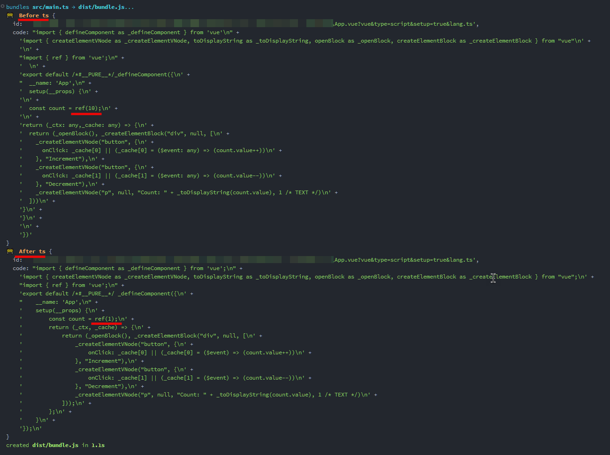

# Repro for rollup-plugin-typescript2 issue [#433](https://github.com/ezolenko/rollup-plugin-typescript2/issues/433)

## Install dependencies

```bash
pnpm install --frozen-lockfile
```

## Watch mode using actual plugin

```bash
pnpm run watch
```

The issue exists for .vue files.



## Watch mode using [fixed](https://github.com/ukhan/rollup-plugin-typescript2/commit/923c7f112885d8a5cc3a54fe79a9c2afe45b1559) plugin

```bash
pnpm run watch:fixed
```

The issue does not exist.
